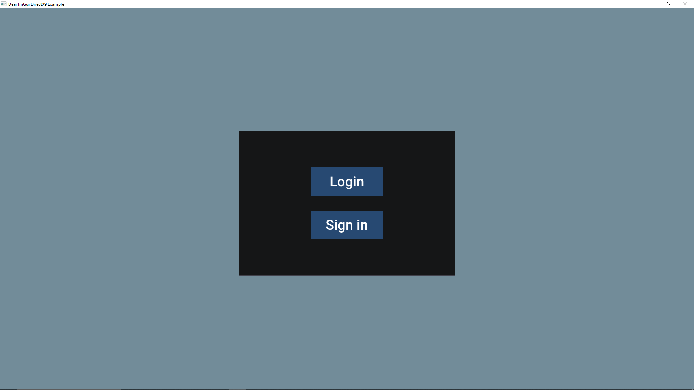
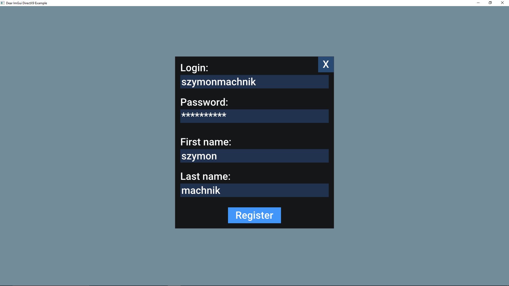
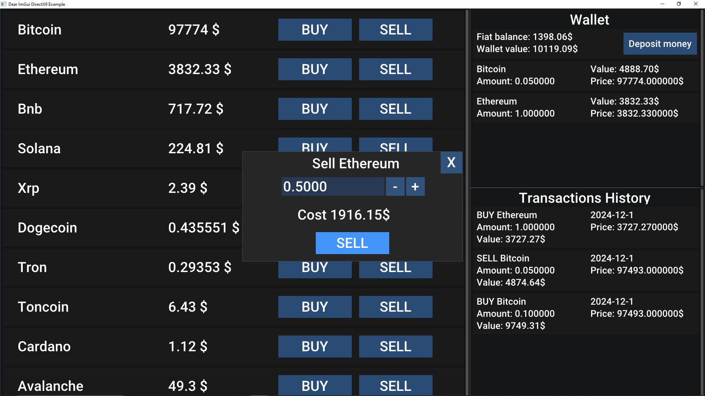

# 🚀 Crypto Market
## 📃 Opis projektu
Crypto Trader to aplikacja z interfejsem graicznym napisana w C++, która umożliwia użytkownikom kupowanie, sprzedawanie, deponowanie i zarządzanie kryptowalutami w portfelu. Dzięki integracji z bazą danych SQLite, aplikacja bezpiecznie przechowuje dane użytkowników, historię transakcji oraz informacje o portfelu.

## 🛠️ Funkcjonalności
### Rejestracja i logowanie użytkowników
  - Użytkownik może założyć konto oraz logować się do istniejącego konta z wykorzystaniem loginu i hasła.
    
  
  
### Zarządzanie portfelem
  - Wyświetlanie posiadanych kryptowalut.
  - Aktualizacja cen kryptowalut w czasie rzeczywistym.
  - Kupno i sprzedaż kryptowalut.
    
  
  
### Lista transakcji
  - Przegląd historii transakcji zawierającej daty, kwoty oraz typy operacji (kupno/sprzedaż).
    
  
### Depozyty i zarządzanie saldem
  - Użytkownik może dokonywać depozytów i sprawdzać swoje saldo.

## 💻 Tech Stack
### Język programowania:
  - C++.
### Baza danych:
  - SQLite3 – lekka baza danych wbudowana w aplikację.
## 📚 Biblioteki
### Curl:
  - Używana do pobierania danych o cenach kryptowalut z API.
### ImGui:
  - Biblioteka do tworzenia interfejsów graficznych, umożliwiająca potencjalne rozszerzenie aplikacji o interfejs graficzny.

## 📜 Credits
### Curl for making crypto price requests:
  - Github: https://github.com/curl/curl
  - Website: https://curl.se/

### Dear ImGui for graphical user interface:
  - Github: https://github.com/ocornut/imgui
  - Website: https://github.com/ocornut/imgui

### Roboto font for letters style:
  - Website: https://fonts.google.com/specimen/Roboto
