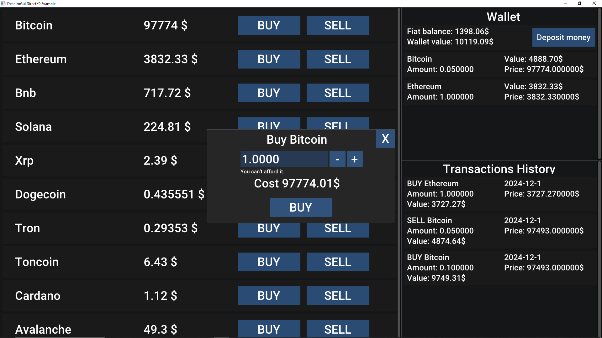

# 🚀 Crypto Market

## 🧭 Navigation
* [📃 Brief description](#-brief-description)
* [🛠️ Functionals](#%EF%B8%8F-functionals)
* [💻 Tech Stack](#-tech-stack)
* [📚 Libraries](#-libraries)
* [📒 To-Do](#-to-do)
* [📘 Last update](#-last-update)
* [📜 Credits](#-credits)

## 📃 Brief description
Crypto Market is an application with graphical interface programming in C++. In Crypto Market user is able to buy, sell and manage his cryptocurrencies in their own wallet. Application stores users’ data, transactions history and wallet information with maximum safety, by using the SQLite3 database locally.

## 🛠️ Functionals
### User registration and login
  - The user can create a new account or log into an existing one using their username and password.
    
  
### Wallet management
  - Displaying currently own cryptocurrencies.
  - Updating cryptocurrencies’ price in real time (with max 5 min delay).
  - Depositing virtual fiat money into the wallet.
    
  
  
### Transaction history
  - Displaying transactions history contains name of cryptocurrency, price at which it was purchased / selled, amount of crypto, spended money, type of transactions and also date when transaction took place.
    
  
### Deposits and Balance Management
  - The user can make deposits and check their balance.

## 💻 Tech Stack
### Programming language:
  - C++.
### Database:
  - SQLite3.
## 📚 Libraries
### Curl:
  - Used for making API requests to fetch cryptocurrency prices.
### ImGui:
  - Used for creating the graphical interface.

## 📒 To-Do
### - Add exporting transaction history and wallet to csv file. 
### - Hashing data in database.

## 📘 Last update
### 6.01.2022 - Added more cryptocurrencies.

## 📜 Credits
### Curl for fetching cryptocurrency prices:
  - Github: https://github.com/curl/curl
  - Website: https://curl.se/

### Dear ImGui for graphical user interface:
  - Github: https://github.com/ocornut/imgui
  - Website: https://github.com/ocornut/imgui

### Roboto font for typography:
  - Website: https://fonts.google.com/specimen/Roboto
